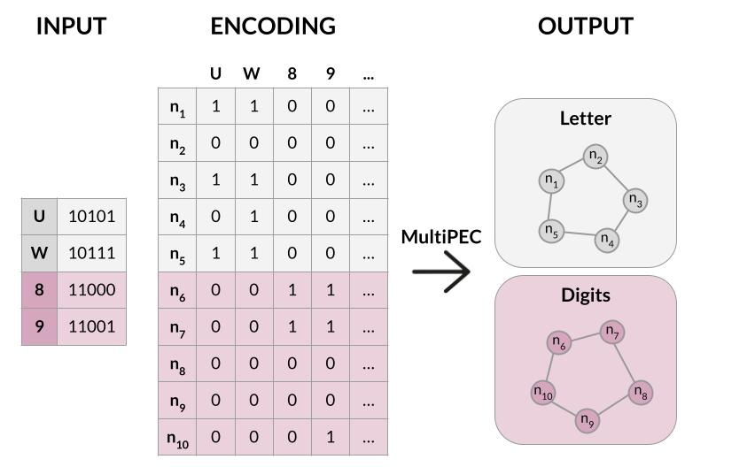

# MultiPEC

**MultiPEC** is a tool for automatic detection of data models from neural activity data, guided purely by the structure of the data.
<br>
<br>
MultiPEC leverages **prediction error connectivity (PEC)** as a network marker, which relates to the complexity of information contained in the network and its consistency across repetitions ​(Principe et al. 2019 doi: 10.1016/j.neuroimage.2018.11.052)​.
<br>
<br>
<p align="center">
  
</p>

## Quick Start

```bash
git clone https://github.com/ivkarla/multipec-core
cd multipec-core
conda create -n multipec python=3.10
conda activate multipec
pip install -e .
